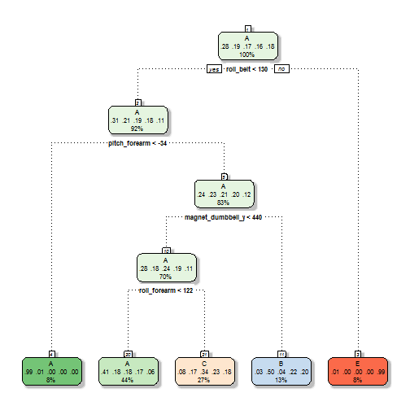

###Title: Practical Machine Learning Project   
###Objective: Predict how well people perform weight lifting exercise using data from accelerometers on the belt 
###<br>

### Data partition
Since the test data does not have the response variable to test for prediction accuracy, here we create a validation set to validate the model selected. We will partition the training data into a training set and a validation set in 0.75 and 0.25 ratio. The training set will be used to build the model, which will be used for prediction on the validation set. The predicted response will be compared to the reference response variable in the validation set for accuracy check.

Before partitioning the training data, we will exclude some variables that do not contribute to the prediction algorithm. We will remove predictors that have lots of missing values ('NA' or '') since they do not have enough information to predict well. We will also remove measurement unrelated variables (e.g user name and timestamps).


```r
#Read in training data
if (!file.exists('pml-training.csv'))
  download.file('https://d396qusza40orc.cloudfront.net/predmachlearn/pml-training.csv', 'pml-training.csv')

training <- read.csv('pml-training.csv', header = T, na.strings = c('NA', ''))

#Outcome variable
rbind(n = table(training$classe), pct = round(prop.table(table(training$classe))*100, 2))
```

```
##           A       B       C       D       E
## n   5580.00 3797.00 3422.00 3216.00 3607.00
## pct   28.44   19.35   17.44   16.39   18.38
```

```r
#Get predcitors that are non-missing in the training dataset
nonMiss <- as.character()
for (i in 1 : ncol(training))
    if (sum(!is.na(training[ ,i])) == nrow(training))  
          nonMiss <- c(nonMiss, colnames(training[i]))
         
nonMiss #down to 60 columns
```

```
##  [1] "X"                    "user_name"            "raw_timestamp_part_1"
##  [4] "raw_timestamp_part_2" "cvtd_timestamp"       "new_window"          
##  [7] "num_window"           "roll_belt"            "pitch_belt"          
## [10] "yaw_belt"             "total_accel_belt"     "gyros_belt_x"        
## [13] "gyros_belt_y"         "gyros_belt_z"         "accel_belt_x"        
## [16] "accel_belt_y"         "accel_belt_z"         "magnet_belt_x"       
## [19] "magnet_belt_y"        "magnet_belt_z"        "roll_arm"            
## [22] "pitch_arm"            "yaw_arm"              "total_accel_arm"     
## [25] "gyros_arm_x"          "gyros_arm_y"          "gyros_arm_z"         
## [28] "accel_arm_x"          "accel_arm_y"          "accel_arm_z"         
## [31] "magnet_arm_x"         "magnet_arm_y"         "magnet_arm_z"        
## [34] "roll_dumbbell"        "pitch_dumbbell"       "yaw_dumbbell"        
## [37] "total_accel_dumbbell" "gyros_dumbbell_x"     "gyros_dumbbell_y"    
## [40] "gyros_dumbbell_z"     "accel_dumbbell_x"     "accel_dumbbell_y"    
## [43] "accel_dumbbell_z"     "magnet_dumbbell_x"    "magnet_dumbbell_y"   
## [46] "magnet_dumbbell_z"    "roll_forearm"         "pitch_forearm"       
## [49] "yaw_forearm"          "total_accel_forearm"  "gyros_forearm_x"     
## [52] "gyros_forearm_y"      "gyros_forearm_z"      "accel_forearm_x"     
## [55] "accel_forearm_y"      "accel_forearm_z"      "magnet_forearm_x"    
## [58] "magnet_forearm_y"     "magnet_forearm_z"     "classe"
```

```r
#Remove non-measurement related columns
nonMiss <- nonMiss[-c(1:7)]

training <- training[ , nonMiss] 
dim(training) #19622, 53
```

```
## [1] 19622    53
```

```r
library(caret)
```

```
## Loading required package: lattice
## Loading required package: ggplot2
```

```r
#Separate into training set and validation set
set.seed(123)
inTrain = createDataPartition(training$classe, p = 3/4)[[1]]
train <- training[inTrain, ]  
valid <- training[-inTrain, ]

dim(train); dim(valid)#14718 vs 4904
```

```
## [1] 14718    53
```

```
## [1] 4904   53
```

### Model building and validation
Different recursive partitioning tree models will be fitted to the training set: 1) model without repeated sampling of observations or bagging (rpart); 2) model with bagging (treebag); 3) model involves both bagging of the observations and predictors (random forest). With extensve resampling of observations and predictors, we expect random forest gives the best prediction. All models have cross-validation applied.

Model #1: rpart

```r
set.seed(101)
fit_rpart <- train(classe ~., method = 'rpart', data = train,
                   trControl = trainControl(method = 'cv', number = 5))
```

```
## Loading required package: rpart
```

```r
fit_rpart$finalModel
```

```
## n= 14718 
## 
## node), split, n, loss, yval, (yprob)
##       * denotes terminal node
## 
##  1) root 14718 10533 A (0.28 0.19 0.17 0.16 0.18)  
##    2) roll_belt< 130.5 13487  9310 A (0.31 0.21 0.19 0.18 0.11)  
##      4) pitch_forearm< -33.95 1199     9 A (0.99 0.0075 0 0 0) *
##      5) pitch_forearm>=-33.95 12288  9301 A (0.24 0.23 0.21 0.2 0.12)  
##       10) magnet_dumbbell_y< 439.5 10359  7433 A (0.28 0.18 0.24 0.19 0.11)  
##         20) roll_forearm< 122.5 6429  3806 A (0.41 0.18 0.18 0.17 0.059) *
##         21) roll_forearm>=122.5 3930  2613 C (0.077 0.17 0.34 0.23 0.18) *
##       11) magnet_dumbbell_y>=439.5 1929   955 B (0.032 0.5 0.043 0.22 0.2) *
##    3) roll_belt>=130.5 1231     8 E (0.0065 0 0 0 0.99) *
```

```r
fit_rpart$results
```

```
##           cp  Accuracy      Kappa AccuracySD    KappaSD
## 1 0.03588721 0.5222917 0.38060835 0.03603623 0.05489415
## 2 0.06098294 0.4156769 0.20796621 0.06811534 0.11449126
## 3 0.11535175 0.3310170 0.07131806 0.04257919 0.06513305
```

```r
library(rattle)
```

```
## Loading required package: RGtk2
## Rattle: A free graphical interface for data mining with R.
## Version 3.5.0 Copyright (c) 2006-2015 Togaware Pty Ltd.
## Type 'rattle()' to shake, rattle, and roll your data.
```

```r
fancyRpartPlot(fit_rpart$finalModel, sub = '')
```

 

```r
pred_rpart <- predict(fit_rpart, newdata = valid)
cm <- confusionMatrix(pred_rpart, valid$classe)

options(scipen = 100)
cm$table; cm$overall[1:4]
```

```
##           Reference
## Prediction    A    B    C    D    E
##          A 1262  378  418  356  144
##          B   20  312   26  141  101
##          C  107  259  411  307  248
##          D    0    0    0    0    0
##          E    6    0    0    0  408
```

```
##      Accuracy         Kappa AccuracyLower AccuracyUpper 
##     0.4879690     0.3307469     0.4738877     0.5020646
```

The dentrogram shows that the classification in the final nodes highly deviates from the actual classification. For example, in node #20, 44% of the data was classified to A while the actual proportion was only 28%. No node led to Class D.

Numerically, the simple tree model has low prediction accuracy at 48.8% or high out of sample error at 51.2%.

###<br>

Model #2: treebag

```r
set.seed(102)
fit_bag <- train(classe ~., method = 'treebag', data = train,
                   trControl = trainControl(method = 'cv', number = 5))
```

```
## Loading required package: ipred
## Loading required package: plyr
## Loading required package: e1071
```

```r
fit_bag$finalModel
```

```
## 
## Bagging classification trees with 25 bootstrap replications
```

```r
fit_bag$results
```

```
##   parameter  Accuracy     Kappa AccuracySD     KappaSD
## 1      none 0.9836936 0.9793726 0.00626867 0.007929726
```

```r
pred_bag <- predict(fit_bag, newdata = valid)
cm <- confusionMatrix(pred_bag, valid$classe)

cm$table; cm$overall[1:4]
```

```
##           Reference
## Prediction    A    B    C    D    E
##          A 1391    8    1    2    0
##          B    1  923   12    1    3
##          C    1   12  834   15    0
##          D    1    5    8  783    2
##          E    1    1    0    3  896
```

```
##      Accuracy         Kappa AccuracyLower AccuracyUpper 
##     0.9842985     0.9801365     0.9804144     0.9875893
```

With repeated sampling, the accuracies for both the training and validation sets have improved a lot to >98%.

####<br>

Model #3: random forest

```r
set.seed(103)
fit_rf <- train(classe ~., method = 'rf', data = train,
                   trControl = trainControl(method = 'cv', number = 5))
```

```
## Loading required package: randomForest
## randomForest 4.6-12
## Type rfNews() to see new features/changes/bug fixes.
```

```r
fit_rf
```

```
## Random Forest 
## 
## 14718 samples
##    52 predictor
##     5 classes: 'A', 'B', 'C', 'D', 'E' 
## 
## No pre-processing
## Resampling: Cross-Validated (5 fold) 
## Summary of sample sizes: 11774, 11774, 11774, 11775, 11775 
## Resampling results across tuning parameters:
## 
##   mtry  Accuracy   Kappa      Accuracy SD   Kappa SD   
##    2    0.9911673  0.9888258  0.0008660035  0.001095524
##   27    0.9906915  0.9882245  0.0014941943  0.001890301
##   52    0.9849839  0.9810049  0.0032293211  0.004086972
## 
## Accuracy was used to select the optimal model using  the largest value.
## The final value used for the model was mtry = 2.
```

```r
fit_rf$finalModel
```

```
## 
## Call:
##  randomForest(x = x, y = y, mtry = param$mtry) 
##                Type of random forest: classification
##                      Number of trees: 500
## No. of variables tried at each split: 2
## 
##         OOB estimate of  error rate: 0.58%
## Confusion matrix:
##      A    B    C    D    E  class.error
## A 4184    1    0    0    0 0.0002389486
## B   13 2828    7    0    0 0.0070224719
## C    0   18 2544    5    0 0.0089598753
## D    0    0   37 2375    0 0.0153399668
## E    0    0    1    4 2701 0.0018477458
```

```r
pred_rf <- predict(fit_rf, newdata = valid)
cm <- confusionMatrix(pred_rf, valid$classe)

cm$table; cm$overall[1:4]
```

```
##           Reference
## Prediction    A    B    C    D    E
##          A 1394    3    0    0    0
##          B    1  944    8    0    0
##          C    0    2  847   19    0
##          D    0    0    0  783    2
##          E    0    0    0    2  899
```

```
##      Accuracy         Kappa AccuracyLower AccuracyUpper 
##     0.9924551     0.9904556     0.9896153     0.9946823
```

```r
varImp(fit_rf, scale = T)
```

```
## rf variable importance
## 
##   only 20 most important variables shown (out of 52)
## 
##                   Overall
## roll_belt          100.00
## yaw_belt            77.99
## magnet_dumbbell_z   68.03
## magnet_dumbbell_y   64.24
## pitch_belt          62.04
## pitch_forearm       58.99
## magnet_dumbbell_x   52.86
## roll_forearm        52.73
## accel_dumbbell_y    45.47
## accel_belt_z        44.96
## magnet_belt_z       44.10
## roll_dumbbell       41.93
## magnet_belt_y       40.45
## accel_dumbbell_z    38.35
## roll_arm            33.70
## accel_forearm_x     31.12
## magnet_forearm_z    29.35
## accel_dumbbell_x    29.30
## yaw_dumbbell        29.15
## gyros_belt_z        28.84
```

With bagging of predictors, we allow to build more trees than the above two models (hence it's called random forest) and thus it takes the longest computation time. But it results in excellent accuracy at 99.3%, or out of sample error at 0.7%.

The list of top 20 predictors shows that roll_belt has the best prediction power.

###<br>

### Prediction with final model
Owing to the most superior accuracy of random forest classification, we adopt the last model for prediction on the test data. Likewise, we will remove non-predicting variables.

```r
#Read in test data
if (!file.exists('pml-testing.csv'))
  download.file('https://d396qusza40orc.cloudfront.net/predmachlearn/pml-testing.csv', 'pml-testing.csv')
testing <- read.csv('pml-testing.csv', header = T)

#Remove non-predicting columns
nonMiss <- as.character()
for (i in 1 : ncol(testing))
    if (sum(!is.na(testing[ ,i])) == nrow(testing))  
          nonMiss <- c(nonMiss, colnames(testing[i]))
         
nonMiss #down to 60 columns
```

```
##  [1] "X"                    "user_name"            "raw_timestamp_part_1"
##  [4] "raw_timestamp_part_2" "cvtd_timestamp"       "new_window"          
##  [7] "num_window"           "roll_belt"            "pitch_belt"          
## [10] "yaw_belt"             "total_accel_belt"     "gyros_belt_x"        
## [13] "gyros_belt_y"         "gyros_belt_z"         "accel_belt_x"        
## [16] "accel_belt_y"         "accel_belt_z"         "magnet_belt_x"       
## [19] "magnet_belt_y"        "magnet_belt_z"        "roll_arm"            
## [22] "pitch_arm"            "yaw_arm"              "total_accel_arm"     
## [25] "gyros_arm_x"          "gyros_arm_y"          "gyros_arm_z"         
## [28] "accel_arm_x"          "accel_arm_y"          "accel_arm_z"         
## [31] "magnet_arm_x"         "magnet_arm_y"         "magnet_arm_z"        
## [34] "roll_dumbbell"        "pitch_dumbbell"       "yaw_dumbbell"        
## [37] "total_accel_dumbbell" "gyros_dumbbell_x"     "gyros_dumbbell_y"    
## [40] "gyros_dumbbell_z"     "accel_dumbbell_x"     "accel_dumbbell_y"    
## [43] "accel_dumbbell_z"     "magnet_dumbbell_x"    "magnet_dumbbell_y"   
## [46] "magnet_dumbbell_z"    "roll_forearm"         "pitch_forearm"       
## [49] "yaw_forearm"          "total_accel_forearm"  "gyros_forearm_x"     
## [52] "gyros_forearm_y"      "gyros_forearm_z"      "accel_forearm_x"     
## [55] "accel_forearm_y"      "accel_forearm_z"      "magnet_forearm_x"    
## [58] "magnet_forearm_y"     "magnet_forearm_z"     "problem_id"
```

```r
nonMiss <- nonMiss[-c(1:7, 60)]

testing <- testing[ , nonMiss]
dim(testing) #20 obs. of  52 variables
```

```
## [1] 20 52
```

```r
pred <- predict(fit_rf, newdata = testing)
pred
```

```
##  [1] B A B A A E D B A A B C B A E E A B B B
## Levels: A B C D E
```
###<br>

####Let's check the answers with the submission program

```r
source('pml_write_files.R')
pml_write_files(pred)
letter <- as.character()
for (i in 1:20){
  x <- read.table(paste('problem_id_', i, '.txt', sep = ''), stringsAsFactors = F)
  x <-as.character(x)
  letter <- c(letter, x)
}
letter
```

```
##  [1] "B" "A" "B" "A" "A" "E" "D" "B" "A" "A" "B" "C" "B" "A" "E" "E" "A"
## [18] "B" "B" "B"
```
All answers are correct!

###<br>

### Citations
Velloso, E.; Bulling, A.; Gellersen, H.; Ugulino, W.; Fuks, H. Qualitative Activity Recognition of Weight Lifting Exercises. Proceedings of 4th International Conference in Cooperation with SIGCHI (Augmented Human '13) . Stuttgart, Germany: ACM SIGCHI, 2013.

